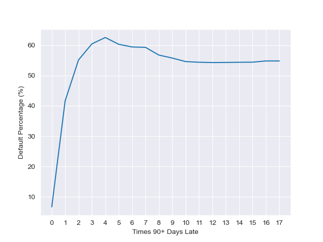

# Risk Exercise for Candidates

This repo contains a risk analysis exercise: predict whether a customer will repay their debt to a lender or not.

## Problem Background

## Business Case
Credit lending company __XYZ__ needs to determine whether a potential client will be able to repay their loan within 2 years (or at least be in a position to repay and not be in serious delinquency). The company collects basic information on the customer (age, income, etc) as well financial information (other open loans, revolving lines of credit, etc). __XYZ__ wants to know what kinds of information about a customer they can utilize to most efficiently and accurately predict whether a client is safe for the company to lend to.

## General Questions
1. __What can be said abut the population of consumers?__
    - 150000 consumers, between the ages of 21 - 109 (w/ 13 people over the age of 100!)
        - one aged 0, most likely bad data (can't offer lines of credit to a 0-year old)
2. __Anything interesting about the predictors?__    
    - 35000 consumers have more monthly debt payments than their monthly income
    - Highest income is $3 million, while >3000 consumers don't report any monthly income.
    - Majority of consumers have 8 open lines of credits and loans
    - Number of dependents ranges from 0 - 20, with some missing values.
    - One consumer has 54 mortgage/real estate loans!
3. __What features can be used to predict that consumer might not pay?__
    - NumberOfTimes90DaysLate
    - RevolvingUtilizationOfUnsecuredLines
    - NumberOfOpenCreditLinesAndLoans
4. __What are some simple recommendations you can make to manage these applicants?__

- If a consumer has been more than 90 days late to repay their loan even once, the chance of them defaulting in 2 years jumps from less than 5% to over 40%. Check this metric and flag the potential client immediately if this value is not zero. If this value hits 2+, the chances of a serious deliquency by the consumer exceeds 50%.

- If a consumer is utilizing just over 100% of their revolving unsecured credit lines, they are the most likely to default on their loans within 2 years. Rejecting a consumer if they fall into the 100-115% range would be the safest option for the company.